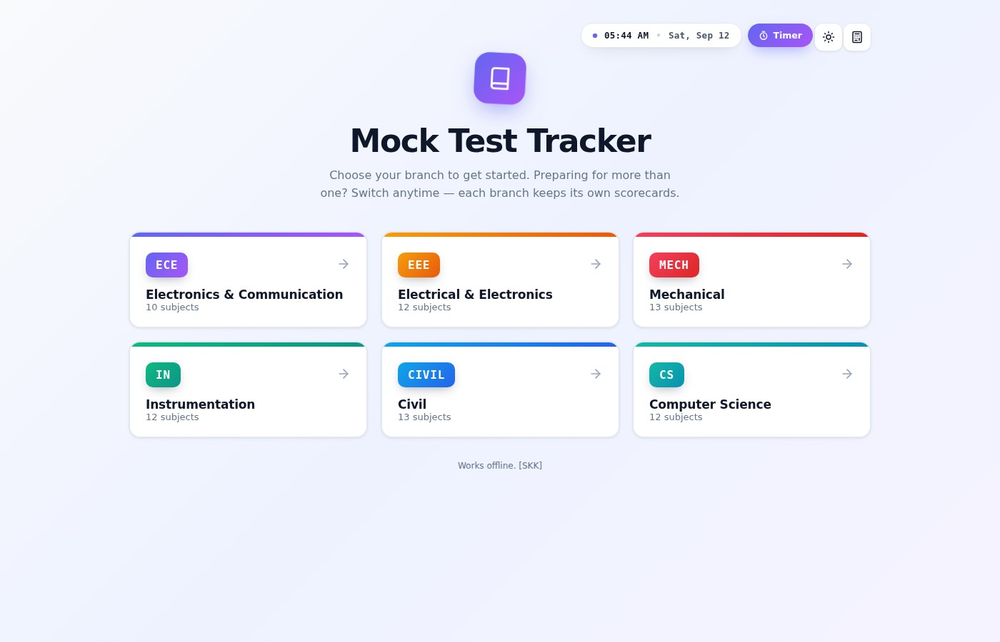
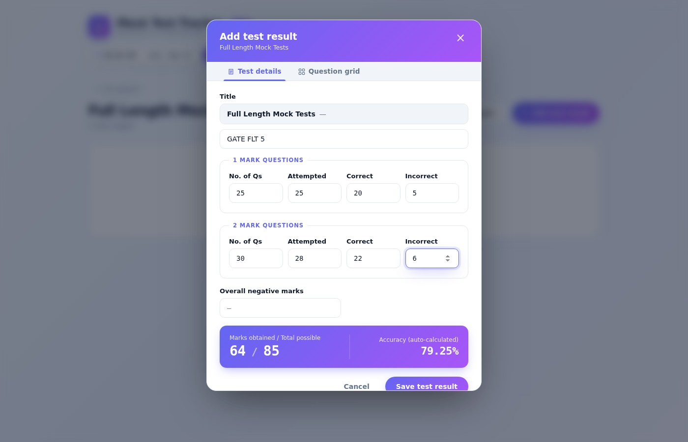
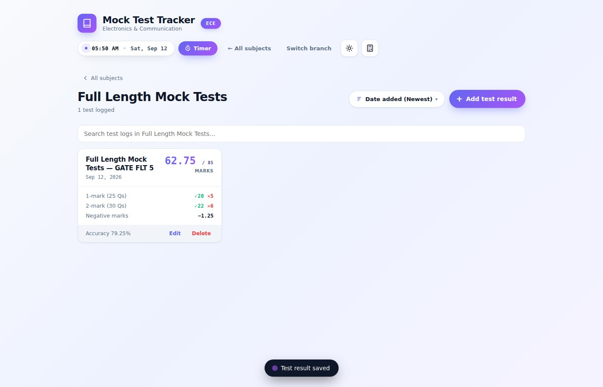
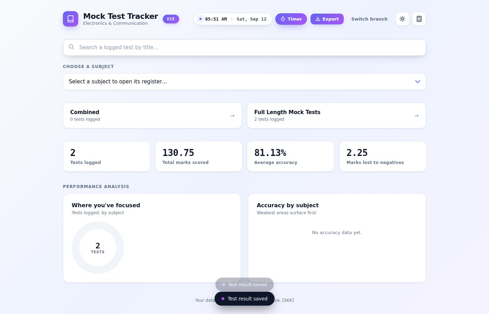
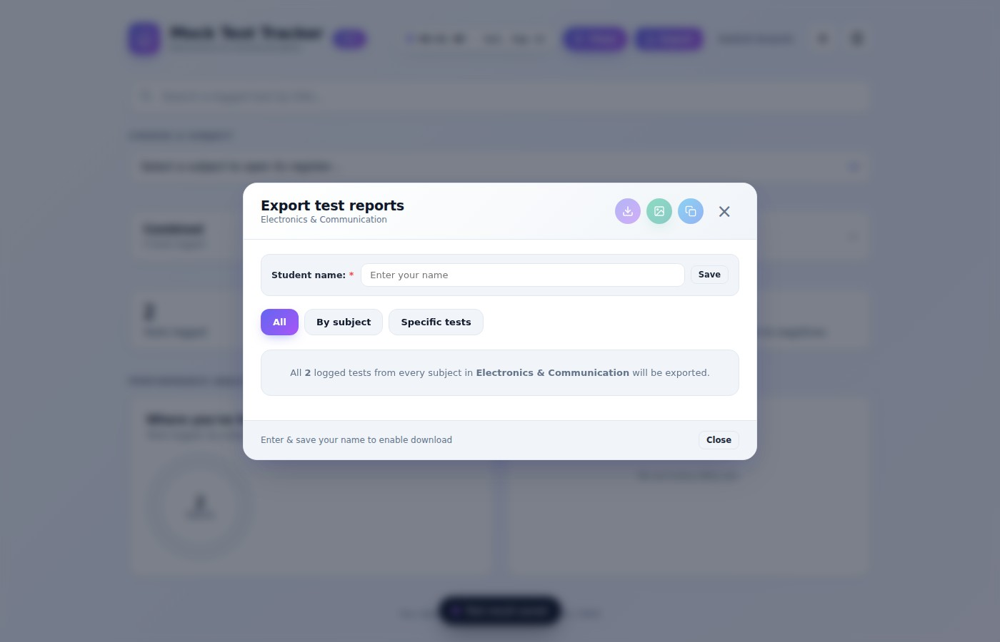
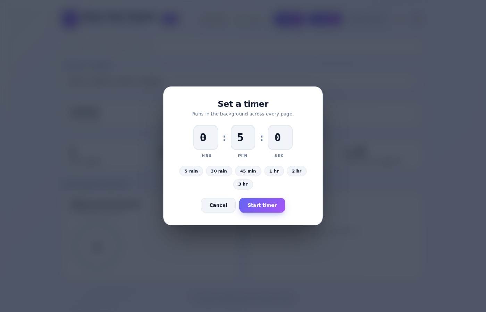
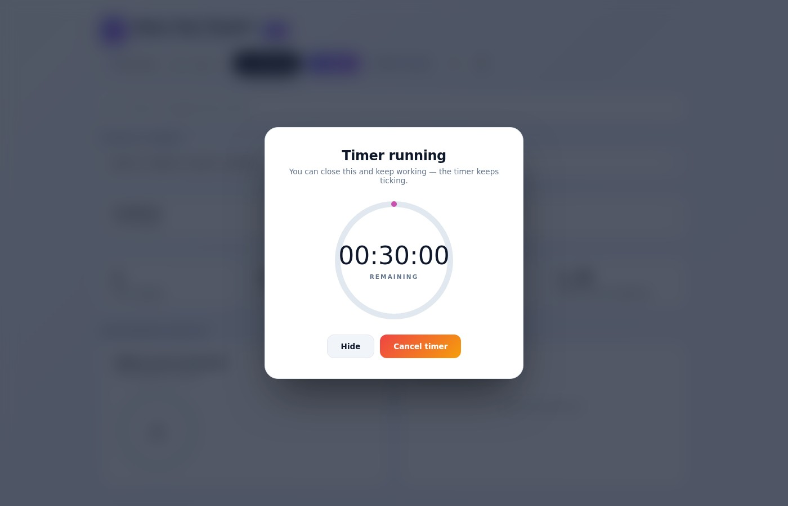

# 📊 Mock Test Tracker

**A free, offline desktop app to log, analyze, and master your GATE mock test performance.**

Built for GATE aspirants who take dozens of mock tests and lose track of where their marks are actually going. Mock Test Tracker turns your test history into clear, subject-wise insights — no spreadsheets, no internet required, all your data stays on your machine.

---

## ⬇️ Download

| Platform | File |
|---|---|
| 🪟 Windows | [Mock Test Tracker Setup 2.0.0.exe](../../releases/latest) |
| 🍎 macOS (Apple Silicon) | [Mock Test Tracker-2.0.0-arm64.dmg](../../releases/latest) |

> No account, no sign-up, no internet connection needed. Download, install, start logging tests.

---

## ✨ Features

### 🎯 Branch-wise mock test logging
Select your engineering branch — **CSE, ECE, EEE, ME, CE**, and more — and log tests against the exact GATE syllabus subjects for that branch (Engineering Mathematics, Data Structures, Signals and Systems, Strength of Materials, Thermodynamics, and dozens more).

### 📝 Full-length & subject-wise tracking
Log both **Full Length Mock Tests** and individual subject tests, recording:
- Marks scored vs. marks possible (auto-calculated live as you type)
- Questions attempted, correct, and incorrect
- Negative marks
- Test title and date

You can enter marks directly, or step through the **Question grid** wizard to log correct/incorrect answers question-by-question.

  
  

Every saved test drops into a clean, searchable log:

### 📈 Instant analytics
See total marks scored, average accuracy, overall negative marks, and a subject-wise performance breakdown — sort your test history by newest or oldest so you know exactly which subjects need more work before exam day.

### 📄 One-click reports
Generate a polished, shareable **Mock Test Report** and export it as:
- **PDF** (formatted report, ready to print or share)
- **JPG** (image snapshot)
- **Plain text** (copy straight to clipboard)

### ⏱️ Built-in exam timer
A background countdown timer with quick presets (5 min, 30 min, 45 min, 1 hr, 2 hr, 3 hr) that keeps running across every screen — simulate real exam conditions with an alarm when time's up.

  
  

### 🧮 Scientific calculator
A built-in calculator for quick working, without alt-tabbing out of the app.

### 🌗 Dark mode
Easy on the eyes for late-night revision sessions — every screen, including the add-test wizard, adapts.

### 💻 Fully offline & cross-platform
Built with Electron — runs natively on **Windows** and **macOS**, and never needs an internet connection. Your test data never leaves your computer.

---

## 🖥️ Installation

### Windows
1. Download `Mock Test Tracker Setup 2.0.0.exe` from the [Releases](../../releases/latest) page.
2. Run the installer and follow the prompts (or use the portable build if you don't want to install).
3. Launch **Mock Test Tracker** from the Start Menu.

### macOS
1. Download `Mock Test Tracker-2.0.0-arm64.dmg` from the [Releases](../../releases/latest) page.
2. Open the `.dmg` and drag **Mock Test Tracker** into your Applications folder.
3. Launch it from Applications (you may need to right-click → Open the first time, since the app isn't notarized by Apple).

---

## 🛠️ Built With

- [Electron](https://www.electronjs.org/) — cross-platform desktop shell
- [jsPDF](https://github.com/parallax/jsPDF) + [jsPDF-AutoTable](https://github.com/simonbengtsson/jsPDF-AutoTable) — PDF report generation
- Vanilla JS, HTML, CSS — no heavy frameworks, fast startup

## 🙋 Why I built this

Preparing for GATE means taking a *lot* of mock tests — and after a while it becomes impossible to remember which subjects are actually weak without hard numbers. Mock Test Tracker is the tool I built for myself to solve that, cleaned up and shared so every GATE aspirant can use it for free.

## 🤝 Contributing & Feedback

Found a bug or have a feature idea? Open an [issue](../../issues) — this app is actively maintained and built around real GATE prep feedback.

If it helped your prep, consider starring ⭐ the repo — it helps more aspirants discover it.

## 📜 License

Licensed under the [MIT License](LICENSE).

---

*Made by [Sanjay Krishna K](https://github.com/) for the GATE aspirant community.*
